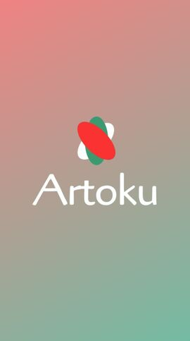
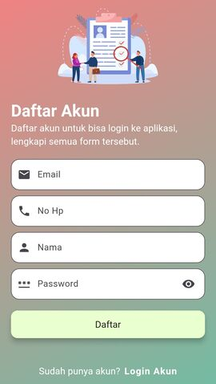
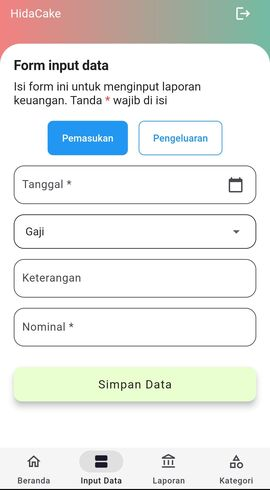
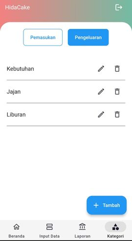

# ArtoKuApp

Dengan aplikasi ini, akan lebih mudah mengelola keuangan, dan mencapai tujuan keuangan Anda.

## Technology

- FrontEnd Mobile : [Flutter](https://docs.flutter.dev/get-started/codelab)
- BackEnd : [Firebase](https://firebase.google.com/)

## Tutorial Install Source Code

- Link tutorial : [Sedap Gaming](https://youtu.be/4tpJdfgY9OM)

## Preview

